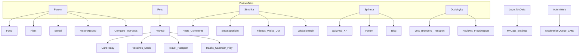

# KnowSnout — креативний бріф

Документ для брендбуку, графічного проєкту та логіки екранів.  
Оновлено: **2026-08-21** (UI Kit v2 · мапа PDF · Variant 12 · звірка з `PRODUCT_VISION.md`).

| Поле | Значення |
|--|--|
| **Бренд** | KnowSnout (колишня робоча назва SnoutScore — лише legacy) |
| **Сайт** | https://knowsnout.com/ |
| **Ринки v1** | Україна + Польща |
| **Платформи** | Android · iOS · Web (Expo) |
| **Мова UI** | Українська (+ вибір PL/EN у налаштуваннях — каркас) |
| **Види тварин зараз** | Собаки і коти (профілі вже допускають «інше» / напр. папуга в кіті) |
| **Види — велика перспектива** | Усі домашні улюбленці + companion «не зовсім домашні» (поетапно) |

### Джерела правди (пріоритет при розбіжностях)

1. **Живий UI + код** (що реально відкривається в апці)  
2. **`BRANDBOOK.md` + `docs/design/KnowSnout-UI-kit-v2-brandbook.pdf`** — колір / лого (Variant 12)  
3. **`docs/design/` PDF (мапа + UI Kit v2)** — IA / карта екранів / модулі A–F + адмінка  
4. **Цей бріф** — наратив, аудиторія, journeys, deliverables  
5. **`PRODUCT_VISION.md`** — беклог ідей (нічого не викидати; статус може бути «горизонт»)

Дизайн-артефакти: `docs/design/*.pdf` · roadmap імплементації: `docs/IMPLEMENTATION_ROADMAP.md`.

---

## 0. Звірка 2026-08-21: суперечності й що не загубилось

### Суперечності (і як вирішуємо)

| Тема | Було в бріфі (до 08-21) | У PDF / кіті | Рішення |
|--|--|--|--|
| **Bottom tabs** | Перевір · Журнал · Квіз · Стрічка · Улюбленці | Перевір · Улюбленці · Стрічка · **Спільнота** · **Довідники** | **Кіт / мапа.** Журнал — nested під Перевір. Квіз+форум+блог — у **Спільноті**. |
| **Палітра** | Lime `#72ED2F` + Teal `#00E0C7` | Brandbook Variant 12: нафтовий + ліс + троянда | **Variant 12** (`BRANDBOOK.md`). Старий lime/teal — legacy. |
| **Organic / Caprasimo** | — | У «ключові екрани» terracotta/sage + Caprasimo/Figtree | **ACTIVE visual:** Organic PDF (cream + sage CTA + Caprasimo/Figtree). Variant 12 color remap — later pass. |
| **Серця Stories** | «teal KnowSnout» | Троянда = емоційний акцент | Серця / емоційні акценти → **rose**; success/safe → **forest**; primary CTA → **navy**. |
| **Форум / блог** | «на горизонті» | Повноцінний модуль у **Спільноті** | У бріфі — **обов’язкові модулі IA**; глибина бекенду — поетапно (mock → cloud). |
| **Порівняти 2 корми** | горизонт | Є в мапі «Вхід і Перевір» | У бріфі — **в scope Перевір**, не «загубити». |
| **Догляд як 5-та вкладка** | опція C* у vision | У кіті догляд лишається під Улюбленцями | **Як у кіті** зараз; окрема вкладка «Догляд» лишається ідеєю в vision (якщо usage доведе). |
| **Адмінка** | майже відсутня | Окремий веб-модуль (ч.7) | У бріфі — **внутрішня панель**; не плутати з мобільним UX. |

### Ідеї з `PRODUCT_VISION.md`, яких **немає** в мапі PDF (зберігаємо)

Ці ідеї **не суперечать** кіту — просто ширший горизонт. **Не викидати:**

| Ідея | Де живе |
|--|--|
| Charity hub + каталог притулків | Vision P3 |
| Усиновлення «хто шукає родину» (staff-led) | Vision P4 |
| Віртуальне утримання / sponsorship конкретної тварини | Vision P5 |
| Розширення видів (кролик, птах, гризун, рептилія…) | Vision P6 + кіт уже каже «не лише dog/cat» |
| Окрема вкладка «Догляд» (якщо usage) | Vision P1 Care C* |
| Chip = private · GDPR · shelter badge на профілі | Vision Legal / Profile |
| Allegro / store scores only | Уже в продукті + vision P1 |
| Paid Plant ID API (коли точність важливіша за бюджет) | Vision P1b |
| Follow graph · care streak · DM cloud | Vision P2 (частково в коді) |
| Призи / партнери конкурсів | Vision P2b later |

### Що мапа PDF **додала** (раніше слабко або не було в бріфі)

- Модуль **Довідники та довіра (F):** ветеринари, заводчики, перевізники, петсіттери, страхування, pet-friendly житло, верифікація, відгук, скарга на шахрайство  
- **Спільнота** як вкладка (квіз + форум + блог + XP/бейджі)  
- Глибший **Spotlight** (гостьове голосування, рейтинг, історія переможців)  
- **Друзі**, прогулянки, теги на фото, глобальний пошук, activity  
- **Онбординг 1–3**, порівняння 2 кормів, звички, календар + Google stub, travel wizard  
- **Адмінка** (черга модерації, CMS правил, ролі)  
- Системні стани: toast, AI loading, network error, permissions, dark theme stub  

---

## 1. Суть застосунку

### Що це
**KnowSnout** — мобільний застосунок довіри й турботи про улюбленців: перевірити корм / рослину / породу, вести профіль і щоденний догляд, бути готовим до подорожі; ділитися життям у **стрічці**, питати й обмінюватися досвідом у **форумі**, читати **блог**, знаходити перевірені **довідники** (клініки, заводчики, транспорт…). Зараз фокус — собаки й коти; у перспективі — усі companion animals.

### Яку проблему вирішує
Власники тварин у UA/PL часто **вгадують**: чи корм нормальний, чи вазон отруйний, чи тварина готова до виїзду, які щеплення «на часі». Досвід інших розкиданий по Instagram / Facebook / Telegram; страх і маркетинг «чудо-детокс» заважають спокійним рішенням. Шахрайство навколо заводчиків / «перевізників» посилює потребу в **довірі з верифікацією**.

**KnowSnout збирає перевірку + турботу + знання спільноти + легкий соцшар + довідники довіри** — з чесними дисклеймерами (не ветдіагноз, не родовід, не юридична порада щодо кордонів).

### Північна зірка (north star)
> Trust + care for pets at home and on the road — then community knowledge (forum + blog), trusted directories, and a gentle social layer for pet lovers, shelters, and charity. Dogs & cats first → all companion animals.

### Ключові обіцянки (не плутати модулі)

| Модуль | UI / маркетинг | Що робить |
|--|--|--|
| Перевірка | вкладка **Перевір** | Корм · Рослина · Порода (+ історія nested, порівняння 2 кормів) |
| Журнал сканів | **Історія** (не окрема tab) | Корм · Рослини · Породи |
| Догляд | під **Улюбленці** | Вода · гра · годування · щеплення · ліки · звички · календар · подорожі · документи |
| Соцшар (фото) | вкладка **Стрічка** / SnoutStories | Пости, серця, коментарі, друзі, чат, Spotlight |
| Знання + навчання | вкладка **Спільнота** | Квіз · **Форум** · **Блог** · XP / бейджі |
| Довіра закладів | вкладка **Довідники** | Ветеринари · заводчики · транспорт · сіттери · … |
| Конкурси | **SnoutSpotlight** | Правила · заявка · рейтинг · переможці (із Стрічки) |
| Профіль людини | **Мої дані** | Не вкладка — кнопка навпроти логотипу |
| Внутрішнє | **Адмінка** (веб) | Модерація · CMS · конкурси · контент |

**Не плутати:** Стрічка = фото й емоції · Форум = питання й досвід · Блог = редакція · DM = приватні повідомлення · Довідники = заклади з верифікацією.

**Не обіцяти рано:** ветдіагноз · 100% точність породи · живі ціни з усіх магазинів · публічний пошук чипа · «миттєве усиновлення» · повна адмінка в магазині для всіх користувачів.

### Короткі слогани
- **UA:** *Знай свою мордочку.*
- **EN:** *Know your snout.*
- **Корм:** *Know what’s in the bowl — before you buy.* / *Знаю, що в мисці*
- **Стрічка:** *Ділися улюбленцями. Збирай сердечка.*

---

## 2. Цільова аудиторія

### Primary (ядро зараз)
- **Власники собак і котів** 20–45 у **Україні та Польщі**
- Турбуються про склад корму, безпеку вдома (рослини), базовий догляд
- Подорожують або планують виїзд з твариною
- Хочуть **спокій і ясність** + місце **спитати / поділитися** (форум) + короткі матеріали (блог)
- Шукають **перевірені контакти** (вет, перевізник) без хаосу чатів

### Secondary
- Люди з кількома улюбленцями («діти» в профілі)
- Власники інших companion (птахи тощо) — профілі й довідники раніше за повну аналітику корму
- Любителі тварин: Stories + форум без Instagram-клону
- Пізніше: волонтери / персонал притулків (верифіковані), благодійність, усиновлення

### Не ціль (зараз)
- Професійні ветеринари як основний продукт (ми не EHR клініки)
- Повна підтримка всієї екзотики в MVP (але бренд **не замикаємо** на dog/cat назавжди)
- Dating / чат-first соцмережа; форум ≠ заміна Stories

### Персона
**«Іра з Києва / Варшави»** — є кіт або собака, купує корм, сумнівається щодо вазона, інколи їде в EU. Хоче: швидко перевірити → зберегти → догляд і щеплення → спитати на форумі → іноді фото в стрічці → знайти клініку / перевізника в довіднику → почитати блог.

---

## 3. Настрій / тон бренду

### Вердикт
**Дружній і теплий до тварин + спокійний і професійний до фактів.**  
Не «медична клініка». Не «дитячий зоопарк з емодзі». Не агресивний wellness-хайп.

| Вісь | Де ми стоїмо |
|--|--|
| Серйозність | Спокійна довіра, не суха бюрократія |
| Дружність | Тепло до мордочок |
| Гумор | М’який; квіз грайливіший |
| Tech | «Читаємо сигнал» (хвилі на логотипі) |
| Care | Чеклисти й нагадування без страшилок |

### Голос (UA)
- Прямо, спокійно, на «ти»
- Без «miracle detox»
- Щеплення / кордони / рослини / довідники: *інформаційно; уточнюй у фахівця*
- Породи: % впевненості, без родоводу
- Види: **Собака / Кіт / Інше** → пізніше richer picker

### Візуальний характер (Variant 12 — активний)

Джерело: `BRANDBOOK.md` · `docs/design/KnowSnout-UI-kit-v2-brandbook.pdf`

| Токен | Hex | Роль |
|--|--|--|
| **Нафтовий (navy)** | `#122A4C` | Структура, nav, headers, primary CTA |
| **Глибокий** | `#0C1C33` | Ink / найглибший текст |
| **Лісова зелень** | `#2F5233` | Safe / healthy / success / score good |
| **Троянда** | `#E8879A` | Емоційний акцент, active, серця |
| Рожевий тінт | `#F4DADF` | М’які rose-заливки (не мішати з green tint у одному блоці) |
| Зелений тінт | `#E3E9DF` | Mist / soft success |
| Тло | `#F7F1ED` | App background |
| Score poor / fair | `#C45C3E` / `#C4922A` | Оцінка корму |

- **Логотип:** мордочка + хвилі; **перефарбований під тему** (navy / forest / rose tiles), не старий lime→teal градієнт  
- **Градієнт продукту:** navy → forest; sparingly  
- **Шрифт UI зараз:** DM Sans · **опційно later:** Caprasimo (display) + Figtree (body) з кіту  
- **Фото:** реальні тварини / корм / дім  
- **Не мішати** rose tint і green tint в одному блоці  

### Атрибути
Trust · Clarity · Care · Modern

---

## 4. Архітектура продукту (логіка екранів)

### Нижня навігація (5 вкладок) — UI Kit v2

```
┌──────────┬──────────┬──────────┬──────────┬──────────┐
│ Перевір  │Улюбленці │  Стрічка │ Спільнота│Довідники │
└──────────┴──────────┴──────────┴──────────┴──────────┘
```

- **Журнал** — екран усередині / з хабу Перевір (не tab)  
- **Квіз** — усередині Спільноти (не tab)  
- **Мої дані** — іконка **навпроти логотипу**, не вкладка  
- **Адмінка** — окремий веб-маршрут для команди (`/(admin)`), не в bottom bar  

### Карта модулів



### Технічний каркас
- **Frontend:** React Native + Expo Router, NativeWind / StyleSheet, TypeScript  
- **Backend:** Supabase (Auth, Postgres, Storage, Edge Functions) + local/mock для нових модулів  
- **AI:** OpenAI Vision лише через Edge — ключ ніколи в клієнті  
- **Дані:** Open Food Facts, Dog/Cat API, Wikidata, Open Trivia, кеш у БД; довідники — curated + UGC з модерацією  
- **Монетизація (пізніше):** Free limited AI · Plus · affiliate · підписка (UI shell уже в кіті)  

---

## 5. Список екранів (за мапою PDF + кіт)

Назви — **як у UI (UA)**. У дужках — route / зона.  
Статус імплементації: дивись `docs/IMPLEMENTATION_ROADMAP.md` (багато нових екранів — **mock / stub**, не pixel-perfect і не prod-backend).

### 5.1 Вхід і онбординг
| Екран | Призначення |
|--|--|
| Вхід / Реєстрація | Auth |
| Онбординг 1–3 | Перший запуск |
| Редірект / індекс | Після сесії |

### 5.2 Вкладки
| Екран | Призначення |
|--|--|
| **Перевір** | Хаб перевірок + входи в історію / compare |
| **Улюбленці** | Список · хаб · догляд |
| **Стрічка** | SnoutStories + входи в Spotlight / друзі / пошук |
| **Спільнота** | Квіз · форум · блог |
| **Довідники** | Хаб категорій довіри |

### 5.3 Перевір (модуль A + D2)
| Екран | Призначення |
|--|--|
| Історія перевірок | Фільтри Корм / Рослини / Породи |
| Скан штрихкод / фото етикетки | Корм |
| Результат корму | Score, match, share, store badge |
| **Порівняти 2 корми** | Side-by-side |
| Рослина → результат | Токсичність + дисклеймер |
| Порода: форма / результат | Confidence % |
| Форма профілю тварини (акордеон) | Зберегти з флоу перевірки |

### 5.4 Улюбленці (B + C + D)
| Екран | Призначення |
|--|--|
| Список / хаб тварини | Switcher кількох pets |
| Профіль (собака / інший вид) | Огляд |
| Догляд сьогодні | Вода · гра · годування |
| Щеплення · форми | Календар доз |
| Ліки та візити · форми | Тонкий журнал |
| Ігри / активності | За видом |
| Звички | Добрі / погані |
| Календар + Google stub | Події догляду |
| Документи · подорожі · wizard | Чеклісти + дедлайни |

### 5.5 Стрічка (E)
| Екран | Призначення |
|--|--|
| Стрічка постів | Лайк / коментар / share |
| Коментарі | Тред |
| Spotlight hub · умови · заявка · рейтинг · переможці · «перемога» | Конкурси |
| Картка учасника · **гостьове голосування (веб)** | Reach |
| Профіль іншого користувача | Соц |
| Активність | Лайки / коментарі / підписники |
| Чат список / розмова | DM |
| Друзі · пошук · запити · invite link/QR | Граф |
| Прогулянка · запрошення в чаті | Офлайн-зустріч |
| Теги pets/друзів на фото | Метадані поста |
| Глобальний пошук | Люди · pets · статті · корми |

### 5.6 Спільнота
| Екран | Призначення |
|--|--|
| Квіз-хаб + класичні квізи | Порода / походження / група / trivia |
| Зум-загадка · Хто важчий? · Правда чи міф | Нові формати |
| Результати · рейтинг гравців · бейджі | Гейміфікація |
| Форум: категорії · стрічка · тред · нове · автор · пошук/теги · правила · сповіщення | Must knowledge |
| Блог: категорії · стаття · коментарі · закладки | Editorial |

### 5.7 Профіль і службові
| Екран | Призначення |
|--|--|
| Мої дані · редагування акаунта | Профіль людини |
| Сповіщення · мова · підписка/платежі | Налаштування |
| Довідка · стаття · підтримка | Help |
| Приватність · джерела даних · заблоковані · delete account | Trust / GDPR |
| 404 · empty states · camera/gallery · share · report/block | Наскрізні |
| AI loading · network error · permissions · toast · dark theme stub | Системні стани |

### 5.8 Довідники (F)
| Екран | Призначення |
|--|--|
| Хаб категорій | Ветеринари · заводчики · перевізники · сіттери · страхування · житло |
| Список + фільтри · картка закладу | Верифікація на картці |
| Відгук · скарга на шахрайство | UGC → черга адмінки |

### 5.9 Адмінка (веб, внутрішня)
| Екран | Призначення |
|--|--|
| Дашборд · єдина черга · картка рішення | Модерація F/E/C-D2 |
| Контент-CMS (версії правил) | Вакцинація / токсичність / travel copy |
| Spotlight / блог / каталог продуктів / банк квізів | Контент |
| Монетизація · користувачі та ролі | Ops |

### 5.10 Горизонт поза мапою (зберігаємо з vision)
- Charity hub · каталог притулків  
- Усиновлення staff-led · «from shelter X»  
- Віртуальне утримання конкретної тварини  
- Окрема вкладка «Догляд» (якщо usage)  
- Повна PL локалізація UI  
- Призи / партнери Spotlight  

---

## 6. Логіка ключових user journeys

### A. «Що в мисці?»
Перевір → Корм → штрихкод або фото → результат → опційно match / store score / share → історія · опційно порівняти 2 корми.

### B. «Чи шкідливий вазон?»
Перевір → Рослина → назва/фото + pet → вердикт + дисклеймер → історія.

### C. «Яка порода?»
Перевір → Порода → фото/назва → підказка + % → історія.

### D. «Догляд сьогодні»
Улюбленці → хаб / догляд → вода · гра · годування (0–3) · щеплення / ліки / звички / календар.

### E. «Готовність до поїздки»
Профіль → подорожі / документи / щеплення · wizard з дедлайнами (інформаційно).

### F. SnoutStories + Spotlight
Стрічка → пост / коментар · Spotlight → заявка / голосування / переможці · друзі → чат → прогулянка.

### G. Профіль людини
Лого → Мої дані → налаштування / підписка / довідка / джерела.

### H. Форум (must)
Спільнота → Форум → категорія → тред → відповідь · модерація · «не заміна вета».

### I. Блог
Спільнота → Блог → категорія → стаття → закладки / коментарі · deep link у Перевір / Догляд.

### J. Довідники довіри
Довідники → категорія → фільтр → картка (верифікація) → відгук / скарга · (пізніше чат із закладом).

### K. Адмінка (команда)
Дашборд → черга → рішення · CMS правил · контент Spotlight / блогу.

---

## 7. Що вже є vs що хочемо (для дизайну / пріоритету)

### У продукті (шліфувати візуально під Variant 12)
- Перевірка корму / рослин / порід + історія  
- Улюбленці, догляд, щеплення, travel, паспорт, вет-лог, ігри  
- Квізи (класичні + нові формати mock)  
- SnoutStories + Spotlight scaffold + DM scaffold  
- Спільнота / довідники / адмін shell — **структура + mock**  
- Брендбук Variant 12 + оновлені logo tiles  

### Пріоритет глибини (не загубити)

| Пріоритет | Що | Нотатка |
|--|--|--|
| **P0 polish** | Pixel / UX під кіт для core Перевір + pets | Після структури |
| **Must** | Форум + блог (cloud + модерація) | Окремо від Stories |
| **Must trust** | Довідники: верифікація + черга скарг у адмінці | Антишахрайство |
| **Should** | Spotlight (гостьове голос., рейтинг) · друзі/QR · теги на фото · чужий профіль | Соц-глибина |
| **Should** | Порівняння кормів · travel wizard · календар (Google later) | Care depth |
| **Big vision** | Усі види · charity · усиновлення · віртуальне утримання | Vision P3–P6 |
| **Later** | Caprasimo/Figtree · dark theme full · платежі live · PL UI | Не блокує IA |

---

## 8. Deliverables для графічного / бренд проєкту

1. **Брендбук Variant 12** — уже в PDF + `BRANDBOOK.md` (підтримувати в sync)  
2. **UI kit** — кнопки navy/rose/forest, tabs, cards, score, empty/toast, avatars  
3. **Іконографія вкладок** — Перевір · Улюбленці · Стрічка · Спільнота · Довідники (+ профіль у хедері)  
4. **Ключові макети mobile-first** — login · Перевір · результат · хаб pets · Стрічка · Спільнота · Довідники · Spotlight  
5. **Маркетинг** — app icon 1024 (navy tile) · splash · feature graphic · watermark  
6. **SnoutStories / Spotlight** — пост, rose-серце, бейджі переможців, гостьове голосування (web)  
7. **Форум + Блог** — тред / категорії / стаття (окремо від фото-стрічки)  
8. **Довідники** — картка з verification badge · фільтри · скарга  
9. **Адмінка (web)** — дашборд · черга · CMS  
10. **Тон фото** — домашнє світло, місце для multi-species  

---

## 9. Одне речення для агентства

> **KnowSnout** — спокійний companion для власників улюбленців у UA/PL: перевірити корм, рослину й породу; вести турботу вдома й у подорожі; питати на форумі й читати блог; ділитися мордочками в стрічці; знаходити перевірені довідники — із теплом до тварин і чесністю до фактів. Зараз собаки й коти; у великій перспективі — усі companion animals, притулки й благодійність.

---

*Цей бріф не замінює `BRANDBOOK.md` (токени) і `PRODUCT_VISION.md` (повний беклог). При розбіжностях: живий UI → брендбук Variant 12 → PDF-мапа IA → цей бріф (наратив) → vision (ідеї на горизонті). Нічого з vision P3–P6 і Care C* не вважати «скасованим» лише тому, що цього ще немає в мапі PDF.*
