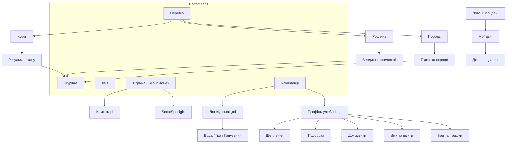

# KnowSnout — креативний бріф

Документ для брендбуку, графічного проєкту та логіки екранів.  
Оновлено: **2026-07-27** (форум · блог · розширення видів). Джерела правди: `PRODUCT_VISION.md`, `PRODUCT_STRUCTURE.md`, `BRANDBOOK.md`, `REMINDERS.md`.

| Поле | Значення |
|--|--|
| **Бренд** | KnowSnout (колишня робоча назва SnoutScore — лише legacy) |
| **Сайт** | https://knowsnout.com/ |
| **Ринки v1** | Україна + Польща |
| **Платформи** | Android · iOS · Web (Expo) |
| **Мова UI** | Українська (польська — пізніше) |
| **Види тварин зараз** | Собаки і коти |
| **Види — велика перспектива** | Усі домашні улюбленці + companion «не зовсім домашні» (поетапно) |

---

## 1. Суть застосунку

### Що це
**KnowSnout** — мобільний застосунок довіри й турботи про улюбленців: перевірити корм / рослину / породу, вести профіль і щоденний догляд, бути готовим до подорожі — ділитися життям у стрічці, **питати й обмінюватися досвідом на форумі**, читати **блог по категоріях**. Зараз фокус — собаки й коти; у перспективі — усі companion animals.

### Яку проблему вирішує
Власники тварин у UA/PL часто **вгадують**: чи корм нормальний, чи вазон отруйний, чи тварина готова до виїзду, які щеплення «на часі». Досвід інших розкиданий по чатах і соцмережах; страх і маркетинг «чудо-детокс» заважають спокійним рішенням.

**KnowSnout збирає перевірку + турботу + знання спільноти + легкий соцшар в одному місці** — з чесними дисклеймерами (не ветдіагноз, не родовід, не юридична порада щодо кордонів).

### Північна зірка (north star)
> Trust + care for pets at home and on the road — then community knowledge (forum + blog) and a gentle social layer for pet lovers, shelters, and charity. Dogs & cats first → all companion animals.

### Ключові обіцянки (не плутати модулі)

| Модуль | Маркетингова / UI назва | Що робить |
|--|--|--|
| Перевірка | вкладка **Перевір** | Корм · Рослина · Порода |
| Журнал сканів | вкладка **Журнал** | Історія: Корм · Рослини · Породи |
| Догляд | **Догляд сьогодні** (+ профіль) | Вода · гра · годування · щеплення · подорожі · документи |
| Розвага / навчання | вкладка **Квіз** | Породи, факти, серія днів |
| Соцшар (фото) | **SnoutStories** → вкладка **Стрічка** | Пости про улюбленців, серця, коментарі |
| **Знання спільноти (must)** | **Форум** | Питати + ділитися досвідом (треди / категорії) |
| Редакція | **Блог** | Статті по категоріях (editorial / curated) |
| Конкурси | **SnoutSpotlight** («Зіркові мордочки») | День / тиждень / місяць / рік |
| Профіль людини | **Мої дані** | Не окрема вкладка — кнопка навпроти логотипу |

**Не плутати:** Стрічка = фото й емоції · Форум = питання й досвід · Блог = редакційні матеріали · DM = приватні повідомлення.

**Не обіцяти рано:** ветдіагноз · 100% точність породи · живі ціни з усіх магазинів · публічний пошук чипа · «миттєве усиновлення».

### Короткі слогани (вже в бренді)
- **UA:** *Знай свою мордочку.*
- **EN:** *Know your snout.*
- **Корм:** *Know what’s in the bowl — before you buy.* / *Знаю, що в мисці*
- **Стрічка:** *Ділися улюбленцями. Збирай сердечка.*

---

## 2. Цільова аудиторія

### Primary (ядро зараз)
- **Власники собак і котів** 20–45 у **Україні та Польщі**
- Турбуються про склад корму, безпеку вдома (рослини), базовий догляд
- Подорожують або планують виїзд (Schengen / не-Schengen) з твариною
- Хочуть **спокій і ясність** + місце **спитати / поділитися досвідом** (форум)
- Читають короткі корисні матеріали (блог), не лише стрічку фото

### Secondary
- Люди з кількома улюбленцями («діти» в профілі)
- Любителі тварин: легкий соцшар (Stories) + форум без Instagram-клону
- Пізніше: власники кроликів, птахів, гризунів, рептилій / інших companion
- Пізніше: волонтери / персонал притулків (верифіковані), благодійність, усиновлення

### Не ціль (зараз)
- Професійні ветеринари як основний продукт (ми не EHR клініки)
- Повна підтримка всіх видів / екзотики в MVP (але бренд і IA **не замикаємо** лише на dog/cat назавжди)
- Важкий dating / чат-first соцмережа; форум ≠ заміна Stories

### Персона (коротко для дизайну)
**«Іра з Києва / Варшави»** — є кіт або собака, купує корм у магазині / онлайн, бачить вазон і сумнівається, інколи їде в EU. Хоче: швидко перевірити → зберегти → нагадати про воду/гру/щеплення → спитати досвідчених на форумі → іноді показати фото в стрічці · почитати статтю в блозі.

---

## 3. Настрій / тон бренду

### Вердикт одним рядком
**Дружній і теплий до тварин + спокійний і професійний до фактів.**  
Не «медична клініка». Не «дитячий зоопарк з емодзі». Не агресивний wellness-хайп.

| Вісь | Де ми стоїмо |
|--|--|
| Серйозність | Спокійна довіра, не суха бюрократія |
| Дружність | Тепло до мордочок, «ми з тобою на одному боці» |
| Гумор | М’який, без мем-перевантаженості; квіз може бути грайливішим |
| Tech | Сучасно-чисто, «читаємо сигнал» (хвилі на логотипі) |
| Care | Турбота в дії (чеклисти, нагадування), без страшилок |

### Голос у текстах (UA)
- Прямо, спокійно, на «ти»
- Без «miracle detox» / «вилікує все»
- Щеплення / кордони / рослини: *інформаційно; уточнюй у ветлікаря / перевізника / при підозрі отруєння — гаряча лінія*
- Породи: % впевненості, без обіцянки родоводу
- Види: **Собака / Кіт / Інше**

### Візуальний характер (для графіки)
Вже зафіксовано в `BRANDBOOK.md` і `src/theme/brand.ts`:

| Токен | Hex | Роль |
|--|--|--|
| Snout Lime | `#72ED2F` | Енергія, старт градієнта, success-акценти |
| Snout Teal | `#00E0C7` | Основна інтерактивність, «сигнал» |
| Snout Ink | `#111B2F` | Текст, вордмарк |
| Surface | `#F7FAF9` | Фон застосунку |
| Mist | `#DFF7F1` | М’які чіпи / вторинні заливки |
| Score poor / fair / good | `#C45C3E` / `#C4922A` / `#0A9B7A` | Оцінка корму |

- **Логотип:** мордочка + хвилі сигналу = *ми читаємо сигнал, щоб ти не вгадувала*
- **Градієнт:** `135deg, #72ED2F → #00E0C7` — лише на марці, score-акцентах, splash; не full-screen «фіолетові AI-мийки»
- **Шрифт UI:** DM Sans · маркетинг (опційно): Fraunces
- **Фото:** реальні тварини / корм / дім; без колажів і стікерів поверх hero
- **Серця в Stories:** teal KnowSnout, не Instagram-рожевий за замовчуванням

### Атрибути бренду (з брендбуку)
Trust · Clarity · Care · Modern  
→ чесні перевірки · одна головна дія на екран · тепло до тварин, точність до складу · tech-clean, не clinic-cold

---

## 4. Архітектура продукту (для логіки екранів)

### Нижня навігація (5 вкладок)

```
┌──────────┬──────────┬──────────┬──────────┬──────────┐
│ Перевір  │  Журнал  │   Квіз   │  Стрічка │Улюбленці │
└──────────┴──────────┴──────────┴──────────┴──────────┘
     ↑                                           ↑
  хаб перевірок                          профілі + догляд
```

**Мої дані** — не вкладка: іконка профілю **навпроти логотипу** у хедері.

### Карта модулів



### Технічний каркас (коротко для команди, не для реклами)
- **Frontend:** React Native + Expo Router, NativeWind, TypeScript  
- **Backend:** Supabase (Auth, Postgres, Storage, Edge Functions)  
- **AI:** OpenAI Vision лише через Edge (`analyze-label`, `identify-breed`, `identify-plant`…) — ключ ніколи в клієнті  
- **Дані:** Open Pet/Food Facts, TheDogAPI / TheCatAPI, Wikidata, Open Trivia, кеш у нашій БД  
- **Монетизація (пізніше):** Free limited AI · Plus · affiliate магазинів  

---

## 5. Список екранів

Назви — **як у UI (українською)**. У дужках — технічний route / файл для команди.

### 5.1 Вхід
| Екран | Призначення |
|--|--|
| Вхід (login) | Бренд + «Знаю, що в мисці» + email/пароль |
| Реєстрація (register) | «Твій спокійний старт» |
| Редірект / індекс | Роут після сесії |

### 5.2 Вкладки
| Екран | Призначення |
|--|--|
| **Перевір** `(tabs)/index` | Хаб: Корм · Рослина · Порода |
| **Журнал** `(tabs)/history` | Вкладинки: Корм · Рослини · Породи |
| **Квіз** `(tabs)/quiz` | Хаб категорій + квіз дня / серія |
| **Стрічка** `(tabs)/stories` | SnoutStories: стрічка постів |
| **Улюбленці** `(tabs)/pets` | Список профілів + вхід у Догляд |

### 5.3 Перевірка (флоу з «Перевір»)
| Екран | Призначення |
|--|--|
| Скан корму `scan-food` | Штрихкод / фото етикетки |
| Результат скану `result` | Оцінка складу, плюси/мінуси, share, Allegro badge, match з улюбленцем |
| Рослини і безпека `plant-safety` | Пошук / фото → токсичність для собаки/кота |
| Результат рослини `plant-result` | Вердикт + дисклеймер |
| Порода `breed-scan` | Фото або назва |
| Результат породи `breed-result` | Підказка + confidence % |

### 5.4 Квіз
| Екран | Призначення |
|--|--|
| Хаб квізу `(tabs)/quiz` | Категорії |
| Вгадай породу `breed-quiz` | Фото + 4 варіанти |
| Звідки порода? / Група `wiki-quiz` | Wikidata |
| Факти про тварин `trivia-quiz` | Open Trivia Animals |
| Результати квізу `quiz-results` | Рейтинг / історія в акаунті |

### 5.5 Улюбленці та догляд
| Екран | Призначення |
|--|--|
| Список улюбленців `(tabs)/pets` | Картки профілів |
| Форма улюбленця `pet-form` | Додати / редагувати |
| Профіль улюбленця `pet-profile` | Огляд + переходи в модулі догляду |
| Догляд сьогодні `care-hub` | Вибір тварини → прогрес 0–3 |
| Сьогодні з улюбленцем `pet-care` | Вода · гра · годування |
| Щеплення `pet-vaccines` | Календар / наступні дози |
| Подорожі `pet-travel` | Чекліст Schengen / non-Schengen |
| Документи `pet-passport` | Чекліст паспорта / паперів |
| Ліки та візити `pet-vet-log` | Тонкий журнал |
| Ігри та іграшки `play-guides` | Editorial packs |

### 5.6 Стрічка та конкурси
| Екран | Призначення |
|--|--|
| Стрічка `(tabs)/stories` | Пости, лайки, фільтри Усі/Коти/Собаки/Мої, список/сітка |
| Коментарі `story-comments` | Тред під постом |
| SnoutSpotlight `contests` | Конкурси день/тиждень/місяць/рік |
| Участь у конкурсі `contest-entry` | Заявка / тема |

### 5.7 Профіль людини та службове
| Екран | Призначення |
|--|--|
| Мої дані `my-data` | Аватар, місто, список улюбленців («діти»), вихід |
| Джерела даних `data-sources` | Атрибуція API / ліцензії |
| 404 `+not-found` | Службовий |

### 5.8 Екрани / шари «майже UI» (модалі, не окремі вкладки)
- Камера / галерея (capture)
- Штрихкод-сканер
- Share sheet (скан / пост)
- Автор-картка в Stories
- Report / block (модерація)

### 5.9 На горизонті (закладати в бренд/IA; не фіналити як live MVP)

**Must-have (обов’язково в продуктовому баченні):**
| Екран / зона | Призначення |
|--|--|
| **Форум** (список категорій / тредів) | Питання + досвід |
| Тред форуму | Питання · відповіді · модерація |
| Нове питання / відповідь | Форми створення |
| **Блог** (список по категоріях) | Editorial статті |
| Стаття блогу | Читання · share · пов’язані теми |

**Також на горизонті:**
- Chat / DM (окремо від форуму)  
- Charity hub + каталог притулків  
- Усиновлення «хто шукає родину» (staff-led)  
- Віртуальне утримання тварини  
- Порівняння 2 кормів  
- Окрема вкладка «Догляд» (умовно)  
- Розширення видів тварин (див. §7)  

---

## 6. Логіка ключових user journeys (для UX / wireframes)

### A. «Що в мисці?» (core)
1. Перевір → Корм  
2. Штрихкод **або** фото етикетки  
3. Результат (score 0–100, плюси/мінуси)  
4. Опційно: сумісність з улюбленцем · оцінка магазину (Allegro) · share  
5. Збереження → Журнал → Корм  

### B. «Чи шкідливий вазон?»
1. Перевір → Рослина  
2. Назва або фото · прив’язка до собаки/кота  
3. Вердикт: безпечно / легкий ризик / токсично / невідомо + дисклеймер  
4. Журнал → Рослини  

### C. «Яка порода?»
1. Перевір → Порода  
2. Фото або пошук назви  
3. Підказка + % · без родоводу  
4. Журнал → Породи  

### D. «Догляд сьогодні»
1. Улюбленці → Догляд сьогодні **або** з профілю  
2. Обрати тварину → вода / гра / годування (0–3)  

### E. «Готовність до поїздки»
1. Профіль улюбленця → Подорожі / Документи / Щеплення  
2. Чеклісти (інформаційно)  

### F. SnoutStories
1. Стрічка → перегляд / лайк / коментар  
2. Публікація фото (+ підпис), опційно прив’язка до улюбленця  
3. Конкурси → SnoutSpotlight  

### G. Профіль людини
1. Кнопка навпроти лого → Мої дані  
2. Аватар · місто · список «дітей» · джерела даних  

### H. Форум (must — майбутній флоу)
1. Форум → категорія (напр. Корм / Поведінка / Вид тварини)  
2. Список тредів → відкрити питання  
3. Відповісти / створити нове питання  
4. Модерація · дисклеймер «не заміна вета»  

### I. Блог
1. Блог → категорія  
2. Стаття → читання / share · опційно deep link у Перевір / Догляд  

---

## 7. Що вже є vs що хочемо (для пріоритету дизайну)

### Вже в продукті (можна і потрібно відшліфувати візуально)
- Перевірка корму / рослин / порід + Журнал  
- Улюбленці (профіль, альбом, аватари, улюблений корм)  
- Догляд сьогодні, щеплення, travel, паспорт, вет-лог, ігри  
- Квіз + серія днів  
- SnoutStories (пости, лайки, коментарі) + конкурси v1  
- Мої дані, джерела даних, share, Allegro badge (каркас)  
- Базовий брендбук і токени кольорів  

### Хочемо далі — пріоритет для наративу бренду
| Пріоритет | Що | Нотатка для дизайну |
|--|--|--|
| **Must** | **Форум** | Окремий патерн від Stories: список тредів, категорії, відповіді |
| **Should** | **Блог** по категоріях | Editorial cards / article layout; SEO на сайті пізніше |
| **Big vision** | Усі види улюбленців + «не зовсім домашні» | Не малювати бренд «тільки пес і кіт назавжди»; залишити місце для species picker |
| Later | Chat/DM · Charity · притулки · усиновлення · віртуальне утримання · PL · Care-вкладка · призи конкурсів | Закладати слоти в IA, не як MVP screens |

---

## 8. Deliverables для графічного / бренд проєкту

Рекомендований пакет від дизайнера (узгодити з наявним `BRANDBOOK.md`):

1. **Брендбук v2** — настрій, голос, логосистема, clear space, don’ts (розширити існуюче)  
2. **UI kit** — кнопки, таби, картки взаємодії, score gauge, empty states, аватари pet/user  
3. **Іконографія вкладок** — Перевір · Журнал · Квіз · Стрічка · Улюбленці (+ профіль у хедері)  
4. **Ключові макети** (mobile-first): login · Перевір · результат корму · профіль улюбленця · Догляд · Стрічка · квіз  
5. **Маркетинг:** app icon 1024 · splash · feature graphic · share watermark KnowSnout  
6. **SnoutStories / Spotlight** — стиль постів, teal-серце, бейджі переможців  
7. **Форум + Блог (макети на горизонт)** — тред / категорії форуму · картка статті блогу (окремо від фото-стрічки)  
8. **Тон фото:** домашнє світло, реальні мордочки (і місце для інших видів у перспективі), без клінічного стерильного look  

---

## 9. Одне речення для агентства

> **KnowSnout** — спокійний companion для власників улюбленців у UA/PL: перевірити корм, рослину й породу, вести турботу вдома й у подорожі, питати й ділитися досвідом на форумі, читати блог — і м’яко показувати мордочок у стрічці. Зараз собаки й коти; у великій перспективі — усі companion animals. Тепло до тварин, чесно до фактів.

---

*Цей бріф не замінює `BRANDBOOK.md` (візуальні токени) і `PRODUCT_VISION.md` (беклог ідей). При розбіжностях пріоритет: живий UI + BRANDBOOK для кольорів/лого, цей файл — для наративу, аудиторії й карти екранів.*
